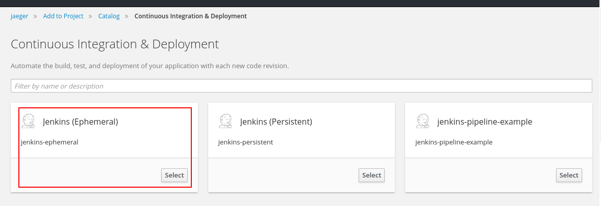
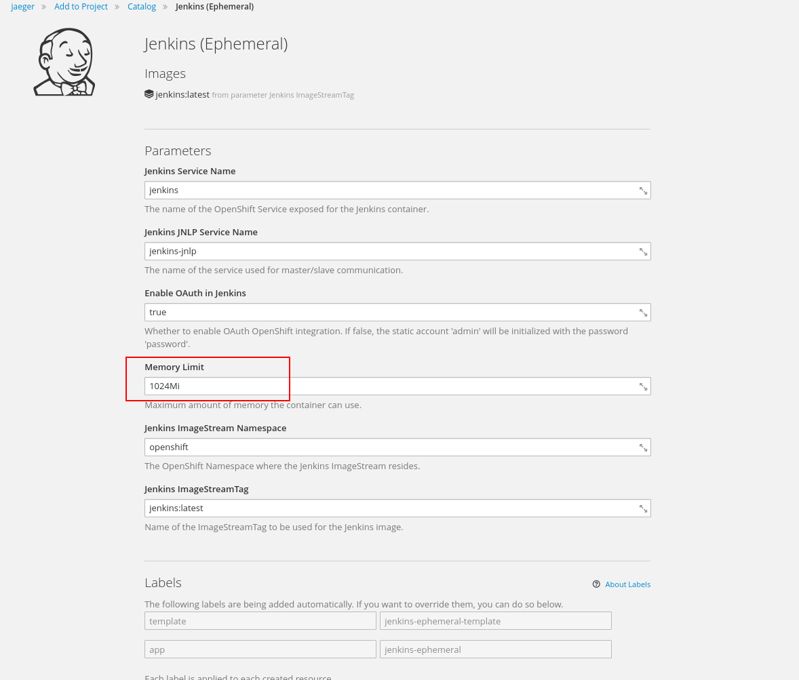

# Jenkins CI
This module can be used to run basic tests of the Jaeger all-in-one and production templates for OpenShift.  The `Jenkinsfile`
can be used to deploy Jaeger to OpenShift using each of these templates and verify them by running a basic set of 
functional tests from [jaeger-java-test](https://github.com/Hawkular-QE/jaeger-java-test) repository.

## How to setup Jenkins CI
These test require an OpenShift instance of version 3.6.0 or later.  See [openshift](https://github.com/openshift/origin)
for more information.

### Create a Jenkins instance on OpenShift
OpenShift offers two versions of Jenkins, one with persistent storage and the other with ephemeral storage.  These instructions
use the ephemeral version, but the persistent version would be preferred.   For more information on  Jenkins on Openshift see [this page](https://github.com/openshift/origin/tree/master/examples/jenkins)

NOTE: Jenkins on OpenShift defaults to using `512Mi` of memory.  These tests require a minimum of `1024Mi` but `2048Mi` may be preferred.

* If necessary create an OpenShift user for running these tests
* Login to the OpenShift console
* Create a project for testing.  (The name `jaeger-ci` is used below but is not required)
* Click on `Add to project` and follow the screens below.

### Update Jenkins plugins
* Login to Jenkins using the link that appears in your new project in the openshift console or get the ip address 
from the `oc get routes` command.
* Update all of the plugins by clicking on `Manage Jenkins` and `Manage Plugins`.  Click the `All` link next to `Select`
at the bottom of the page, then click the `Download now and install after restart` button.  Finally check the `Restart Jenkins...`
checkbox.  Jenkins will install all required updates and restart.  This make take a few minutes.

### Setup Jenkins tools [`maven-3.5.0` and `jdk8`]
* Log back into Jenkins
* Go to `Manage Jenkins` >> `Global Tool Configuration`
* Under `JDK` click `JDK installations...` and add the latest JDK8 version with the name `jdk8`.  Don't forget to click
the license checkbox.
* Under `Maven` click `Maven installations`.  Add maven 3.5.0 and name it `maven-3.5.0`.  

NOTE: The names `jdk8` and `maven-3.5.0` are used in the Jenkinsfile.  If you wish to move to newer versions, they
will need to be changed there also.

### Enable Anonymous read permission on Jenkins server
We have a [script](push-logs.sh) to publish console log to the world from internal Jenkins server. 
This requires global anonymous read permission.

* Login to Jenkins console
* Go to `Manage Jenkins` >> `Configure Global Security`
* Under the section `Access Control`, `Authorization`, `Matrix based security` enable `read` permission for `Anonymous` user
in both the `Overall` and `Job` categories
* Click on the `Save` button at the bottom of the page.

### Setup GitHub access token on Jenkins server credentials
To publish PR status and console log back to GitHub, Jenkins needs GitHub authentication token with required permission. 
To create GitHub access token follow [this document](https://help.github.com/articles/creating-a-personal-access-token-for-the-command-line/)

* Login to Jenkins console
* Go to `Credentials` >> `System` >> `Global credentials (unrestricted)` >> `Add Credentials`
* Select `Kind` as `Username with password`
* Enter GitHub username on `Username` field
* Enter GitHub access token on `Password` field
* Enter `jaegertracing_gh_token` on `ID` field. (**Important:** `jaegertracing_gh_token` id is required by [Jenkinsfile](Jenkinsfile). 
Do not use different ID or leave this field as blank)
* To save this configuration click on `OK` button.

### Create Jenkins job with existing pipeline scripts
Jenkins pipeline script is located [here](/jenkins-ci/Jenkinsfile)

* Login to Jenkins console
* Click on `New Item`
* Enter `Enter an item name` (for example: jaegertracing-ci)
* Select project type as `Multibranch Pipeline` and click `OK`
* Set the project source
    * Under `Branch Sources` click `Add source` and select `GitHub`
    * Select the user created above in the`Credentials` box
    * Enter `jaegertracing` as the owner
    * Select `jaeger-openshift` in the `Repository` field
* Under `Scan Multibranch Pipeline Triggers` click on the checkbox next to `Periodically if not otherwise run` and then
set the `Interval` to `1 minute`
* Under `Build Configuration` >> `Mode` change `Script Path` to `jenkins-ci/Jenkinsfile`
* Under `Orphaned Item Strategy` set `Discard old items` as needed, depending on how much storage you have available.
* Save the project

All set ready :)